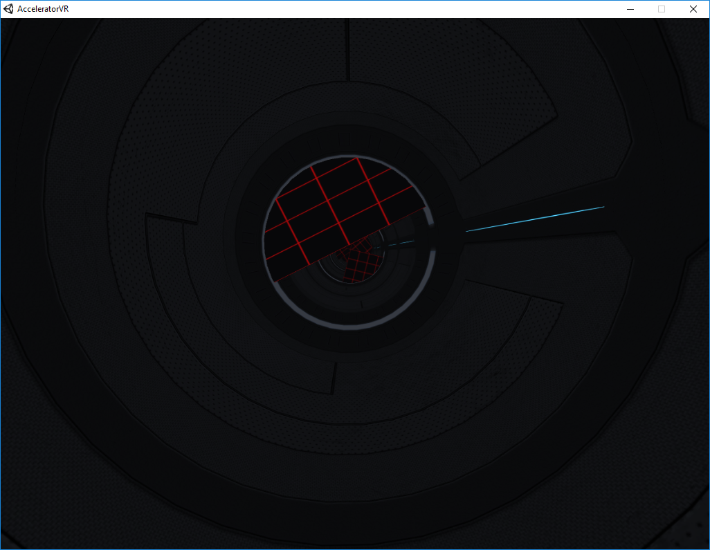

Accelerator VR is a real-time 3D game for the Oculus Rift. The objective of the game is to dodge obstacles as long as possible to increase your score. It relies solely on headtracking as its primary control scheme.

The game was initially developed for the Oculus Rift Development Kit 2 (DK2) with Oculus runtime versions 0.6 - 0.8. The first public runtime release (version 1.3) contained breaking changes, which made it impossible to play the game on newer runtimes.

I upgraded the Unity package “Oculus Utilities for Unity” used in the game to the latest version: 1.21.0. Together with a change in the user input script, this allowed the game to be run with the latest Oculus Rift software / runtime.

Please be aware, that the game was tested with the DK2, so it might behave differently on the Consumer Version. However it is assumed to work.

Build with Unity Version 2017.3.0f3

